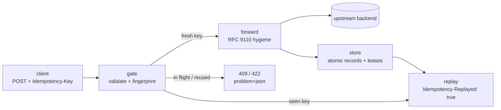

# idemgate

[English](README.md) | [中文](README.zh.md) | [日本語](README.ja.md)

[](LICENSE) [](go.mod) [](CHANGELOG.md)  [](CONTRIBUTING.md)

**idemgate：任意の HTTP バックエンドに Idempotency-Key 重複排除を追加する、置くだけのオープンソース・リバースプロキシ —— Stripe 級の二重課金防止を、ファイル永続ストアとアプリコード変更ゼロで。**


```bash
git clone https://github.com/JaydenCJ/idemgate.git && cd idemgate && go install ./cmd/idemgate
```

> プレリリース：v0.1.0 はまだモジュール tag として公開されていないため、上記のとおりソースからインストールしてください。単一の静的バイナリ、ランタイム依存ゼロ。

## なぜ idemgate？

Stripe は冪等キーを業界標準にしました。クライアントはリトライし、ネットワークは揺らぎ、同じ POST を二度実行する決済 API は二度請求します。定石の解決策——`Idempotency-Key` ヘッダを受け取り、最初のレスポンスを保存し、リトライにはそれを再生する——は広く知られていますが、その実装のほぼすべてはアプリの*内側*にあります。こちらに Express ミドルウェア、あちらに Rails gem、そしてこのバグに最も耐えられないサービスには手作りの Redis ロック。スタックが 2 言語にまたがれば実装も 2 回、キャッシュがメモリなら、デプロイのたびに最悪のタイミングで全キーを忘れます。idemgate はこの契約全体をプロキシ層へ移します。任意のバックエンドの前に静的バイナリを 1 つ置くだけで、同一キーのリトライは保存済みレスポンスを再生し、矛盾する再利用は 422 で拒否され、同時重複は 409 を受け取り、レコードは再起動に耐える普通のファイルです。アプリコードは冪等性の存在すら知りません。

| | idemgate | フレームワーク別ミドルウェア | アプリ内自作（Stripe 方式） | API ゲートウェイのプラグイン |
| --- | --- | --- | --- | --- |
| 任意の言語/バックエンドで動く | はい —— プロキシだから | フレームワークごとに 1 実装 | アプリの言語のみ | はい、ゲートウェイ運用が前提 |
| アプリコードの変更 | なし —— ポートの向き先を変えるだけ | 依存を追加して配線 | ロック・保存・再生ロジック | なし |
| ストレージ | 普通のファイル、アトミック書き込み | パッケージ次第；メモリのみも多い | 自前運用の Redis/Postgres | ゲートウェイ付属ストア |
| 同時重複の扱い | 実行中は 409 + `Retry-After` | 未定義なことが多い | ロックは自作 | プラグイン次第 |
| 同キー別ペイロードの再利用 | リクエスト指紋で 422 | ほぼ未チェック | チェックは自作 | プラグイン次第 |
| 再起動 / デプロイ後も有効 | はい —— ファイル永続 | メモリキャッシュでは不可 | はい | はい |
| 追加インフラ | 静的バイナリ 1 つ | なし | 運用すべきデータストア | ゲートウェイ一式 |

<sub>比較は 2026-07 時点の各方式の一般的な姿を反映：フレームワークミドルウェアはパッケージごとに異なり（プロセスメモリにレコードを置くものが複数）、自作の列は決済各社のエンジニアリングブログで広まった Redis ベースのレシピを指します。</sub>

## 特徴

- **構造からして言語非依存** —— 重複排除はプロキシ層で行われるため、後ろが Node でも Rails でも Django でも Spring でも築 15 年の PHP モノリスでも、コード変更ゼロで全部カバー。
- **Stripe 型のセマンティクス** —— 完全一致のリトライは `Idempotency-Replayed: true` 付きで保存済みレスポンスを再生；メソッド・パス・body が異なるキー再利用は 422 で拒否；元リクエストの実行中に届いた重複は 409 + `Retry-After`；ゲートのエラーはすべて RFC 9457 problem+json。
- **ファイル永続で再起動に強い** —— キーごとにアトミック書き込みのファイル 1 つ、SHA-256 でシャーディング、`--ttl` で失効；デプロイやクラッシュで実行済みリクエストを忘れることはなく、ストアは `ls`/`rm`/`purge` で管理。
- **静かに壊れず、安全側に倒れる** —— 5xx・バックエンド不達・上限超過の body は一切保存せず、失敗した試行はリトライ可能なまま；壊れたレコードは再課金するくらいならエラーを返す；クラッシュが残した実行リースは `--lease-timeout` 後に回収。
- **シムではなく本物のプロキシ** —— RFC 9110 の hop-by-hop ヘッダを双方向で除去、`X-Forwarded-For/Host/Proto` と `Via` を付与、対象外トラフィックはストリーミングで素通し、上流のパスプレフィックスにも対応。
- **依存ゼロ・テレメトリゼロ** —— 純 Go 標準ライブラリ、デフォルトで `127.0.0.1` にバインド、プロキシ環境変数は無視、ログにはキーのハッシュのみで原文は残さない；88 個のオフラインテストとエンドツーエンドのスモークスクリプトで検証済み。

## クイックスタート

同梱の（わざと非冪等な）決済バックエンドを起動し、その前に idemgate を置きます：

```bash
go build -o backend ./examples/backend && ./backend --listen 127.0.0.1:9000 &
idemgate serve --upstream http://127.0.0.1:9000 --store ./gate-store
```

実際に取得した出力：

```text
idemgate 0.1.0 proxying http://127.0.0.1:8080 -> http://127.0.0.1:9000 (store ./gate-store, ttl 24h0m0s, methods POST)
```

課金を 1 件実行し、クライアントにまったく同じリクエストを「リトライ」させます：

```bash
curl -i -H 'Idempotency-Key: order-42' -H 'Content-Type: application/json' \
  -d '{"amount":1999,"currency":"usd"}' http://127.0.0.1:8080/charges
```

実際に取得した出力——初回はバックエンドで実行され、リトライはストアからバイト単位で同一のまま、印付きで応答されます：

```text
HTTP/1.1 201 Created
Content-Length: 66
Content-Type: application/json
Date: Mon, 13 Jul 2026 12:16:20 GMT
Idempotency-Replayed: true
Location: /charges/ch_1

{"id":"ch_1","amount":1999,"currency":"usd","status":"succeeded"}
```

同じキーを別金額で使い回すのはクライアントのバグであり、ゲートは推測せずそう明言します（実際に取得した出力）：

```text
HTTP/1.1 422 Unprocessable Entity
Cache-Control: no-store
Content-Type: application/problem+json
Date: Mon, 13 Jul 2026 12:16:20 GMT
Content-Length: 191

{"type":"about:blank","title":"idempotency key reused","status":422,"detail":"this idempotency key was already used with a different method, path or body; use a fresh key for a new request"}
```

`curl http://127.0.0.1:8080/processed` でバックエンドが 1 回だけ実行されたことを確認できます。`bash examples/demo.sh` はこの一連の流れをエンドツーエンドで再現します。

## ゲートのセマンティクス

| 状況 | idemgate の応答 | バックエンド実行？ |
| --- | --- | --- |
| 対象メソッドの新規キー | バックエンドのレスポンスを返し、保存 | する |
| 完全一致のリトライ（同キー + 同リクエスト） | 保存済みレスポンス + `Idempotency-Replayed: true` | しない |
| 同キーでメソッド/パス/body が異なる | `422` problem+json | しない |
| 元リクエストの実行中のリトライ | `409` + `Retry-After: 1` | しない |
| 対象メソッドだがキーなし | そのまま素通し（`--require-key` なら `400`） | する / しない |
| バックエンドが 5xx または不達 | 転送 / `502` —— **一切保存せず**、リトライで再実行 | — |
| `--ttl` より古いレコード | 新規キーとして扱う | する |

リクエストは指紋——`sha256(method, target, body)`、正規化なし——で照合され、4xx レスポンスも*保存されます*。カード拒否はリトライしても拒否のままであるべきだからです。ディスク上のレコード形式やリースのライフサイクルを含む完全な契約は [docs/gate-semantics.md](docs/gate-semantics.md) に規定しています。

## 設定

設定はすべて `idemgate serve` のフラグで、ドリフトする設定ファイルはありません：

| フラグ | デフォルト | 効果 |
| --- | --- | --- |
| `--upstream` | *（必須）* | バックエンドのオリジン。例 `http://127.0.0.1:9000`；パスプレフィックス可 |
| `--listen` | `127.0.0.1:8080` | プロキシのバインドアドレス（`:0` で空きポートを選んで表示） |
| `--store` | `.idemgate` | レコード/リースのディレクトリ |
| `--ttl` | `24h` | レコードの保持期間；失効したキーは再実行される |
| `--methods` | `POST` | ゲート対象メソッドのカンマ区切り；安全なメソッドは拒否 |
| `--header` | `Idempotency-Key` | キーを運ぶヘッダ |
| `--require-key` | オフ | 対象リクエストにキーがなければ `400` を返す |
| `--lease-timeout` | `30s` | クラッシュが残した実行リースを回収するまでの猶予 |
| `--max-request` | `1MiB` | キー付きリクエストの body 上限（超過 → `413`） |
| `--max-response` | `8MiB` | 保存対象レスポンスの上限（超過 → 届けるが保存しない） |

`idemgate ls|rm|purge --store DIR` でレコードを管理します。終了コード：`0` 正常、`1` 操作上の失敗、`2` 用法/設定/IO エラー。ログのキーはハッシュ接頭辞のみで、原文は決して出ません。

## アーキテクチャ



## ロードマップ

- [x] v0.1.0 —— ゲート型リバースプロキシ（再生/409/422/400/413）、指紋照合、TTL と遅延失効付きのアトミックなファイルストア、クラッシュ安全なリース、`ls`/`rm`/`purge`、RFC 9110 ヘッダ衛生、problem+json エラー、依存ゼロ、88 テスト + スモークスクリプト
- [ ] マルチプロセスストア：flock ベースのリースでレプリカが 1 ディレクトリを共有
- [ ] TLS 終端と HTTPS 上流の検証オプション
- [ ] 特大レスポンスは保存を諦めずディスクへスプール
- [ ] テナント別キースコープ（認証ヘッダをキーにハッシュ）のオプション
- [ ] 構造化 JSON アクセスログとステータス/メトリクスエンドポイント

全リストは [open issues](https://github.com/JaydenCJ/idemgate/issues) を参照してください。

## コントリビュート

バグ報告・セマンティクスの議論・pull request を歓迎します —— ローカルの手順は [CONTRIBUTING.md](CONTRIBUTING.md)（`go test ./...` と `SMOKE OK` を出力する `scripts/smoke.sh`）へ。入門向けタスクは [good first issue](https://github.com/JaydenCJ/idemgate/issues?q=is%3Aissue+is%3Aopen+label%3A%22good+first+issue%22)、設計の話題は [Discussions](https://github.com/JaydenCJ/idemgate/discussions) でどうぞ。

## ライセンス

[MIT](LICENSE)
