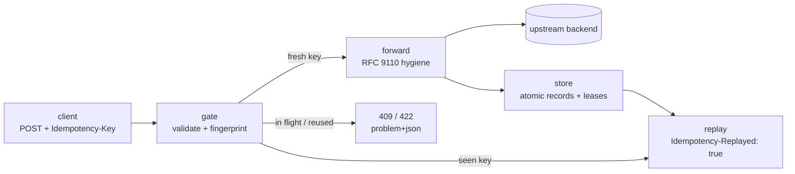

# idemgate

[English](README.md) | [中文](README.zh.md) | [日本語](README.ja.md)

[](LICENSE) [](go.mod) [](CHANGELOG.md)  [](CONTRIBUTING.md)

**idemgate：a drop-in open-source reverse proxy that adds Idempotency-Key deduplication to any HTTP backend — Stripe-grade double-charge protection with a file-backed store and zero application changes.**


```bash
git clone https://github.com/JaydenCJ/idemgate.git && cd idemgate && go install ./cmd/idemgate
```

> Pre-release: v0.1.0 is not yet published as a module tag; install from source as above. A single static binary, no runtime dependencies.

## Why idemgate?

Stripe made idempotency keys table stakes: clients retry, networks flake, and a payment API that executes the same POST twice bills someone twice. The standard fix — accept an `Idempotency-Key` header, store the first response, replay it on retry — is well understood, yet almost every implementation lives *inside* an application: an Express middleware here, a Rails gem there, a hand-rolled Redis lock in the service that could least afford the bug. If your stack spans two languages you implement it twice; if the cache is in-memory, a deploy forgets every key at the worst moment. idemgate moves the whole contract to the proxy layer: put one static binary in front of any backend, and retries with the same key replay the stored response, conflicting reuse is refused with 422, concurrent duplicates get 409, and the records are plain files that survive restarts. Your application code never learns idempotency existed.

| | idemgate | per-framework middleware | DIY in-app (Stripe blueprint) | API gateway plugin |
| --- | --- | --- | --- | --- |
| Works with any language/backend | yes — it is a proxy | one framework each | your app's language only | yes, if you run the gateway |
| Application code changes | none — repoint the port | add and wire a dependency | locks, storage, replay logic | none |
| Storage | plain files, atomic writes | varies; often memory-only | Redis/Postgres you operate | the gateway's own store |
| Concurrent duplicate handling | 409 + `Retry-After` while in flight | often unspecified | you build the locking | varies by plugin |
| Key reuse with a new payload | 422 via request fingerprint | rarely checked | you build the check | varies by plugin |
| Survives restarts / deploys | yes — file-backed | memory caches do not | yes | yes |
| Extra infrastructure | one static binary | none | a datastore to operate | a full gateway |

<sub>Comparison reflects the common shape of each approach as of 2026-07: framework middlewares differ per package (several keep records in process memory); the DIY column is the build-it-on-Redis recipe popularized by payment providers' engineering blogs.</sub>

## Features

- **Language-agnostic by construction** — deduplication lives at the proxy layer; Node, Rails, Django, Spring or a 15-year-old PHP monolith behind it are all covered with zero code changes.
- **Stripe-shaped semantics** — exact retries replay the stored response with `Idempotency-Replayed: true`; key reuse with a different method, path or body is refused with 422; a duplicate arriving while the original is executing gets 409 + `Retry-After`; every gate error is RFC 9457 problem+json.
- **File-backed and restart-proof** — one atomically-written file per key, sharded by SHA-256, expired by `--ttl`; a deploy or crash never forgets what was already executed, and `ls`/`rm`/`purge` administer the store.
- **Fails safe, never silently** — 5xx, unreachable backends and over-cap bodies are never stored so failed attempts stay retryable; corrupt records fail closed instead of re-charging; crashed in-flight leases are stolen after `--lease-timeout`.
- **A real proxy, not a shim** — RFC 9110 hop-by-hop headers stripped both ways, `X-Forwarded-For/Host/Proto` and `Via` set, streaming pass-through for everything ungated, upstream path prefixes supported.
- **Zero dependencies, zero telemetry** — pure Go stdlib, binds `127.0.0.1` by default, ignores proxy environment variables, logs key hashes instead of raw keys; verified by 88 offline tests plus an end-to-end smoke script.

## Quickstart

Start the bundled (deliberately non-idempotent) payments backend and put idemgate in front of it:

```bash
go build -o backend ./examples/backend && ./backend --listen 127.0.0.1:9000 &
idemgate serve --upstream http://127.0.0.1:9000 --store ./gate-store
```

Real captured output:

```text
idemgate 0.1.0 proxying http://127.0.0.1:8080 -> http://127.0.0.1:9000 (store ./gate-store, ttl 24h0m0s, methods POST)
```

Charge a card, then let the client "retry" the exact same request:

```bash
curl -i -H 'Idempotency-Key: order-42' -H 'Content-Type: application/json' \
  -d '{"amount":1999,"currency":"usd"}' http://127.0.0.1:8080/charges
```

Real captured output — the first call executes on the backend; the retry is served from the store, byte-identical, and marked:

```text
HTTP/1.1 201 Created
Content-Length: 66
Content-Type: application/json
Date: Mon, 13 Jul 2026 12:16:20 GMT
Idempotency-Replayed: true
Location: /charges/ch_1

{"id":"ch_1","amount":1999,"currency":"usd","status":"succeeded"}
```

Reusing the key with a different amount is a client bug, and the gate says so instead of guessing (real captured output):

```text
HTTP/1.1 422 Unprocessable Entity
Cache-Control: no-store
Content-Type: application/problem+json
Date: Mon, 13 Jul 2026 12:16:20 GMT
Content-Length: 191

{"type":"about:blank","title":"idempotency key reused","status":422,"detail":"this idempotency key was already used with a different method, path or body; use a fresh key for a new request"}
```

`curl http://127.0.0.1:8080/processed` confirms the backend executed exactly once. `bash examples/demo.sh` runs this whole story end to end.

## Gate semantics

| Situation | idemgate answers | Backend executes? |
| --- | --- | --- |
| Fresh key on a gated method | the backend's response, stored | yes |
| Exact retry (same key + same request) | stored response + `Idempotency-Replayed: true` | no |
| Same key, different method/path/body | `422` problem+json | no |
| Retry while the original is still running | `409` + `Retry-After: 1` | no |
| Gated method without a key | passed through (or `400` with `--require-key`) | yes / no |
| Backend 5xx or unreachable | forwarded / `502` — **never stored**, a retry re-executes | — |
| Record older than `--ttl` | treated as a fresh key | yes |

Requests are matched by fingerprint — `sha256(method, target, body)`, no canonicalization — and 4xx responses *are* stored: a card decline must stay declined on retry. The full contract, including the on-disk record format and the lease lifecycle, is specified in [docs/gate-semantics.md](docs/gate-semantics.md).

## Configuration

All configuration is flags on `idemgate serve`; there is no config file to drift:

| Flag | Default | Effect |
| --- | --- | --- |
| `--upstream` | *(required)* | backend origin, e.g. `http://127.0.0.1:9000`; a path prefix is honored |
| `--listen` | `127.0.0.1:8080` | proxy bind address (`:0` picks a free port and prints it) |
| `--store` | `.idemgate` | record/lease directory |
| `--ttl` | `24h` | record retention; expired keys re-execute |
| `--methods` | `POST` | comma-separated methods to gate; safe methods are refused |
| `--header` | `Idempotency-Key` | header that carries the key |
| `--require-key` | off | answer `400` when a gated request has no key |
| `--lease-timeout` | `30s` | staleness bound before a crashed in-flight lease is stolen |
| `--max-request` | `1MiB` | body cap for keyed requests (over → `413`) |
| `--max-response` | `8MiB` | stored-response cap (over → delivered but not stored) |

`idemgate ls|rm|purge --store DIR` administer the records. Exit codes: `0` ok, `1` operational failure, `2` usage/config/IO error. Logs identify keys only by hash prefix, never verbatim.

## Architecture



## Roadmap

- [x] v0.1.0 — gating reverse proxy (replay/409/422/400/413), fingerprint matching, file-backed atomic store with TTL + lazy expiry, crash-safe leases, `ls`/`rm`/`purge`, RFC 9110 header hygiene, problem+json errors, zero dependencies, 88 tests + smoke script
- [ ] Multi-process stores: flock-based leases so replicas can share one directory
- [ ] TLS termination and HTTPS upstream verification options
- [ ] Spool oversized responses to disk instead of skipping storage
- [ ] Optional per-tenant key scoping (hash an auth header into the key)
- [ ] Structured JSON access log and a status/metrics endpoint

See the [open issues](https://github.com/JaydenCJ/idemgate/issues) for the full list.

## Contributing

Bug reports, semantics discussions and pull requests are welcome — see [CONTRIBUTING.md](CONTRIBUTING.md) for the local workflow (`go test ./...` plus `scripts/smoke.sh` printing `SMOKE OK`). Good entry points are labelled [good first issue](https://github.com/JaydenCJ/idemgate/issues?q=is%3Aissue+is%3Aopen+label%3A%22good+first+issue%22), and design questions live in [Discussions](https://github.com/JaydenCJ/idemgate/discussions).

## License

[MIT](LICENSE)
