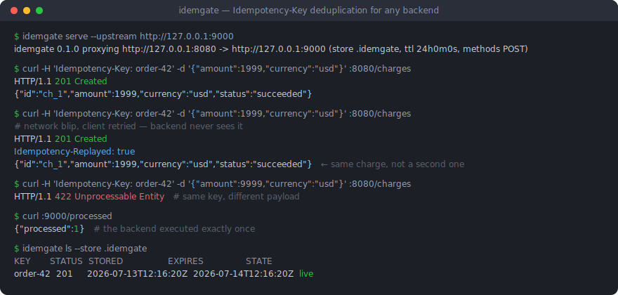
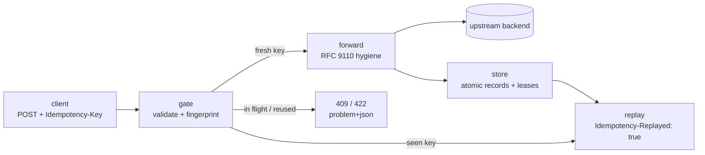

# idemgate

[English](README.md) | [中文](README.zh.md) | [日本語](README.ja.md)

[](LICENSE) [](go.mod) [](CHANGELOG.md)  [](CONTRIBUTING.md)

**idemgate：一个开源的即插即用反向代理，为任意 HTTP 后端加上 Idempotency-Key 去重 —— Stripe 级别的防重复扣款保护，文件存储、零应用代码改动。**



```bash
git clone https://github.com/JaydenCJ/idemgate.git && cd idemgate && go install ./cmd/idemgate
```

> 预发布：v0.1.0 尚未发布模块 tag，请按上述方式从源码安装。单个静态二进制，零运行时依赖。

## 为什么选 idemgate？

Stripe 让幂等键成了行业标配：客户端会重试、网络会抖动，一个把同一 POST 执行两次的支付 API 就会重复扣款两次。标准解法——接受 `Idempotency-Key` 头、存下首次响应、重试时原样重放——早已人尽皆知，但几乎所有实现都活在应用*内部*：这边一个 Express 中间件，那边一个 Rails gem，最经不起这个 bug 的服务里还有一把手搓的 Redis 锁。技术栈跨两种语言就得实现两遍；缓存放内存里，一次部署就在最糟的时刻忘掉全部键。idemgate 把整套契约挪到代理层：在任意后端前面放一个静态二进制，同键重试即重放已存响应、冲突复用被 422 拒绝、并发重复得到 409，而记录是普通文件，重启也不丢。你的应用代码根本不知道幂等这回事。

| | idemgate | 各框架中间件 | 应用内自研（Stripe 蓝本） | API 网关插件 |
| --- | --- | --- | --- | --- |
| 任意语言/后端可用 | 可以 —— 它是代理 | 一个框架一份实现 | 仅限应用自身语言 | 可以，前提是运营网关 |
| 应用代码改动 | 无 —— 改个端口指向 | 引入并接线一个依赖 | 锁、存储、重放逻辑 | 无 |
| 存储 | 普通文件，原子写入 | 因包而异；常为纯内存 | 自己运维的 Redis/Postgres | 网关自带存储 |
| 并发重复处理 | 执行中返回 409 + `Retry-After` | 往往未定义 | 锁要自己造 | 因插件而异 |
| 同键换载荷复用 | 依请求指纹返回 422 | 很少检查 | 检查要自己造 | 因插件而异 |
| 重启 / 部署后仍有效 | 是 —— 文件持久化 | 内存缓存做不到 | 是 | 是 |
| 额外基础设施 | 一个静态二进制 | 无 | 一套要运维的数据库 | 一整套网关 |

<sub>对比反映 2026-07 各方案的常见形态：框架中间件因包而异（多款把记录存进程内存）；自研一列指支付厂商工程博客带火的 Redis 自建方案。</sub>

## 特性

- **架构上即语言无关** —— 去重发生在代理层；后面无论是 Node、Rails、Django、Spring 还是 15 年陈的 PHP 单体，零代码改动全部覆盖。
- **Stripe 式语义** —— 完全一致的重试重放已存响应并带上 `Idempotency-Replayed: true`；同键换方法、路径或 body 的复用被 422 拒绝；原请求执行期间到达的重复得到 409 + `Retry-After`；所有网关错误均为 RFC 9457 problem+json。
- **文件持久化、重启不丢** —— 每键一个原子写入的文件，按 SHA-256 分片，按 `--ttl` 过期；部署或崩溃不会忘掉已执行的请求，`ls`/`rm`/`purge` 负责管理存储。
- **安全失败、绝不无声** —— 5xx、后端不可达和超限 body 一律不存，失败的尝试保持可重试；损坏记录宁可报错也不重复扣款；崩溃遗留的执行租约在 `--lease-timeout` 后被接管。
- **真正的代理，不是垫片** —— 双向剥除 RFC 9110 逐跳头，设置 `X-Forwarded-For/Host/Proto` 和 `Via`，未纳管流量全程流式透传，支持上游路径前缀。
- **零依赖、零遥测** —— 纯 Go 标准库，默认绑定 `127.0.0.1`，无视代理环境变量，日志只记键哈希不记原文；由 88 个离线测试加端到端冒烟脚本验证。

## 快速上手

启动附带的（故意非幂等的）支付后端，把 idemgate 挡在它前面：

```bash
go build -o backend ./examples/backend && ./backend --listen 127.0.0.1:9000 &
idemgate serve --upstream http://127.0.0.1:9000 --store ./gate-store
```

真实抓取的输出：

```text
idemgate 0.1.0 proxying http://127.0.0.1:8080 -> http://127.0.0.1:9000 (store ./gate-store, ttl 24h0m0s, methods POST)
```

扣一笔款，然后让客户端"重试"一模一样的请求：

```bash
curl -i -H 'Idempotency-Key: order-42' -H 'Content-Type: application/json' \
  -d '{"amount":1999,"currency":"usd"}' http://127.0.0.1:8080/charges
```

真实抓取的输出——首次调用在后端执行；重试由存储直接应答，字节级一致并带标记：

```text
HTTP/1.1 201 Created
Content-Length: 66
Content-Type: application/json
Date: Mon, 13 Jul 2026 12:16:20 GMT
Idempotency-Replayed: true
Location: /charges/ch_1

{"id":"ch_1","amount":1999,"currency":"usd","status":"succeeded"}
```

同一个键换个金额复用是客户端 bug，网关会明说而不是瞎猜（真实抓取的输出）：

```text
HTTP/1.1 422 Unprocessable Entity
Cache-Control: no-store
Content-Type: application/problem+json
Date: Mon, 13 Jul 2026 12:16:20 GMT
Content-Length: 191

{"type":"about:blank","title":"idempotency key reused","status":422,"detail":"this idempotency key was already used with a different method, path or body; use a fresh key for a new request"}
```

`curl http://127.0.0.1:8080/processed` 可确认后端只执行了一次。`bash examples/demo.sh` 会把这整个故事端到端跑一遍。

## 网关语义

| 场景 | idemgate 的应答 | 后端是否执行？ |
| --- | --- | --- |
| 纳管方法上的全新键 | 后端的响应，并存储 | 是 |
| 完全一致的重试（同键 + 同请求） | 已存响应 + `Idempotency-Replayed: true` | 否 |
| 同键但方法/路径/body 不同 | `422` problem+json | 否 |
| 原请求仍在执行时的重试 | `409` + `Retry-After: 1` | 否 |
| 纳管方法但没带键 | 直接透传（配 `--require-key` 则 `400`） | 是 / 否 |
| 后端 5xx 或不可达 | 转发 / `502` —— **一律不存**，重试会重新执行 | — |
| 记录早于 `--ttl` | 视为全新键 | 是 |

请求按指纹匹配——`sha256(method, target, body)`，不做任何规范化——且 4xx 响应*会*被存储：拒付在重试时必须仍是拒付。完整契约（含磁盘记录格式与租约生命周期）见 [docs/gate-semantics.md](docs/gate-semantics.md)。

## 配置

全部配置都是 `idemgate serve` 的命令行旗标，没有会漂移的配置文件：

| 旗标 | 默认值 | 作用 |
| --- | --- | --- |
| `--upstream` | *（必填）* | 后端源，如 `http://127.0.0.1:9000`；支持路径前缀 |
| `--listen` | `127.0.0.1:8080` | 代理绑定地址（`:0` 自动选端口并打印） |
| `--store` | `.idemgate` | 记录/租约目录 |
| `--ttl` | `24h` | 记录保留时长；过期的键会重新执行 |
| `--methods` | `POST` | 逗号分隔的纳管方法；安全方法会被拒绝 |
| `--header` | `Idempotency-Key` | 承载键的请求头 |
| `--require-key` | 关 | 纳管请求没带键时应答 `400` |
| `--lease-timeout` | `30s` | 崩溃遗留的执行租约多久后可被接管 |
| `--max-request` | `1MiB` | 带键请求的 body 上限（超出 → `413`） |
| `--max-response` | `8MiB` | 可存储响应的上限（超出 → 照常送达但不存） |

`idemgate ls|rm|purge --store DIR` 管理记录。退出码：`0` 正常，`1` 操作性失败，`2` 用法/配置/IO 错误。日志中键只以哈希前缀出现，绝无原文。

## 架构



## 路线图

- [x] v0.1.0 —— 纳管型反向代理（重放/409/422/400/413）、指纹匹配、带 TTL 与惰性过期的文件原子存储、崩溃安全租约、`ls`/`rm`/`purge`、RFC 9110 头部卫生、problem+json 错误、零依赖、88 个测试 + 冒烟脚本
- [ ] 多进程存储：基于 flock 的租约，让多副本共享同一目录
- [ ] TLS 终结与 HTTPS 上游校验选项
- [ ] 超大响应落盘暂存，而非放弃存储
- [ ] 可选的按租户键隔离（把认证头哈希进键里）
- [ ] 结构化 JSON 访问日志与状态/指标端点

完整列表见 [open issues](https://github.com/JaydenCJ/idemgate/issues)。

## 参与贡献

欢迎 bug 报告、语义讨论和 pull request —— 本地流程见 [CONTRIBUTING.md](CONTRIBUTING.md)（`go test ./...` 加上打印 `SMOKE OK` 的 `scripts/smoke.sh`）。入门任务标为 [good first issue](https://github.com/JaydenCJ/idemgate/issues?q=is%3Aissue+is%3Aopen+label%3A%22good+first+issue%22)，设计问题请到 [Discussions](https://github.com/JaydenCJ/idemgate/discussions)。

## 许可证

[MIT](LICENSE)
